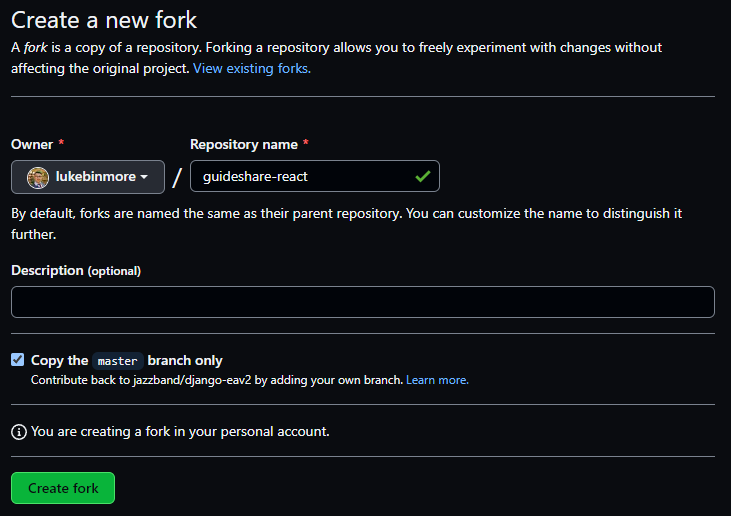
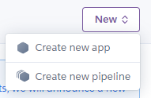
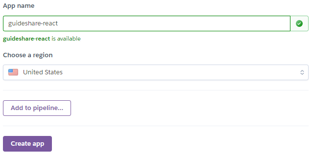
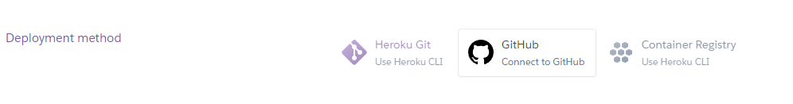
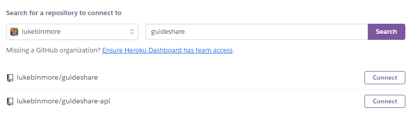
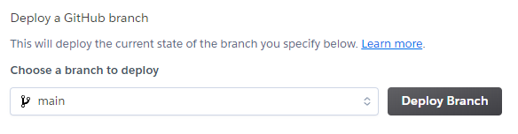
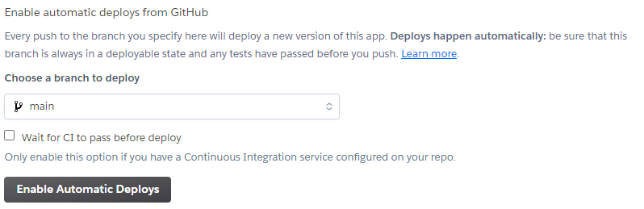

# [**Go Back**](https://github.com/lukebinmore/guideshare)

# **Table Of Contents**
- [**Go Back**](#go-back)
- [**Table Of Contents**](#table-of-contents)
- [**Deployment**](#deployment)
  - [**Step 1: Cloning Repository**](#step-1-cloning-repository)
  - [**Deploying to Heroku**](#deploying-to-heroku)

***

# **Deployment**

This project has been deployed using Heroku. Please see below for instructions on how to clone and deploy this project for your own use.

## **Step 1: Cloning Repository**

Before it can be deployed, the repository needs to be cloned to you own Github account so that it can be interacted with.

 - Step 1 - Login or Signup to [GitHub](https://github.com/).
   - Head to [github.com](https://github.com/).
   - Select Sign Up if you don't have an account, or Sign In if you do from the top right corner of the page. Enter your credentials, or create your new account.
   - 
 - Step 2 - Navigate to the Project Page.
   - Head to [Project Page](https://github.com/lukebinmore/guideshare-api).
 - Step 3 - Fork the repository.
   - Select the Fork option in the top right of the window.
   - 
   - Fill in the form, providing your new repository name and optional description.
   - Click Create Fork when ready.
   - 

***

## **Deploying to Heroku**

After forking the repository, we can now deploy the project to Heroku.

- Step 1 - Login or Signup to [Heroku](https://www.heroku.com/)
  - Head to [heroku.com](https://www.heroku.com/).
  - Select Sign Up if you don't have an account, or Sign In if you do from the top right corner of the page. Enter your credentials, or create your new account.
  - 
- Step 2 - Create a New App.
  - From the Dashboard, select the New option in the top right corner of the window. Then select create new app.
  - 
  - Enter a name for the app, and choose the closest reigon. Then select Create App.
  - 
- Step 3 - Set up Environment Variables
  - Select the Settings option from the navigation bar at the top of the window.
  - 
  - Select Reveal Config Vars.
  - 
  - In the available KEY and VALUE fields, add the below variables without the speachmarks and select Add for each entry.
  - 
    - KEY: "REACT_APP_API_URL" - VALUE: "YOUR DEPLOYED API URL"
- Step 4 - Link GitHub Repository.
  - Select the Deploy option from the navigation bar at the top of the window.
  - 
  - Select GitHub from the selection of deployment methods.
  - 
  - Select the option to connect Heroku to Github, and sign in with your GitHub details.
  - In the repo-search, enter the name of your github repository and select search. Select Connect on the correct repository.
- Step 5 - Deploy
  - 
  - Select the option to Deploy Branch at the bottom of the page, for the first run to ensure deployment is successful.
  - 
  - After the deployment succeeds, select the Enable Automatic Deploys option to enable automatic deploys of future updates to the repository.
  - 

***